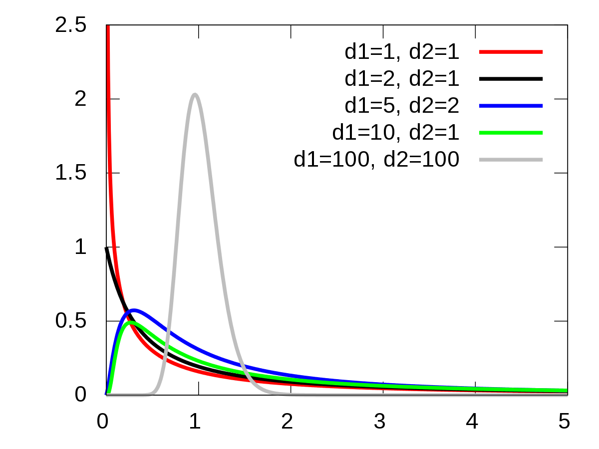

```{r setup, include=FALSE}
knitr::opts_chunk$set(echo = FALSE, message = FALSE, fig.align = "center")
library(tidyverse)
library(patchwork)
library(here)
library(latex2exp)
source(here("Statisztika 1/02 scripts/shadecurve.R"))
source(here("Statisztika 1/02 scripts/plot_normal.R"))


round2 = function(x, n) {
  posneg = sign(x)
  z = abs(x)*10^n
  z = z + 0.5 + sqrt(.Machine$double.eps)
  z = trunc(z)
  z = z/10^n
  z*posneg
}
```

## Alapfogalmak és kérdések

- Mi a statisztikai hipotézis?
- Milyen a jó hipotézis?
- Mire vonatkozik a hipotézis?
- Milyen paraméterekre, jellemzőkre vonatkozhat?
- Minek végzünk hipotézisvizsgálatot?
- Mi a nullhipotézis / ellenhipotézis? Milyen ezek viszonya?
- Mi az első / másodfajú hiba?
- Mi a nulleloszlás?
- Mit jelent, hogy egy próba szignifikáns?

# Kétmintás próbák a várható értékre

## Kétmintás (független mintás) próbák

- Két **független** populációban vizsgáljuk 
- egy változó **várható értékének különbségét**
- Két populáció, független változó: nominális
- Függő változó: intervallum- vagy arányskála
- Mintában különbözik a várható érték két csoportban
- Állítható-e, hogy ezek **a populációban sem egyenlők?**

$$H_0: \mu_1 = \mu_2$$
$$H_1: \mu_1 \ne \mu_2$$
vagy: $< / >$

## A választék

- Mindhárom esetben feltétel a normális eloszlás - tesztelendő
  

1. Kétmintás u-próba: ismert populációs szórásokkal
2. Kétmintás t-próba: ha a becsült szórások alapján a populációban szóráshomogenitás van
3. Kétmintás Welch-próba: ha nem feltételezhető a szóráshomogenitás

- Utóbbi két esetben a szóráshomogenitást tesztelni kell: F-próba
- Robusztusság vs. próba ereje  

$$u > t > t_w$$

## Kétmintás u-próba

- ismert valódi szórású 
- normális eloszlású változókkal

$$u = \frac{\overline{X}-\overline{Y}}{\sqrt{\frac{\sigma_x^2}{N_x}+\frac{\sigma_y^2}{N_y}}}$$  
  
Nulleloszlása: N(0;1)

## Kétmintás u-próba nulleloszlása

$\mu_x = 200; \quad \mu_y = 200; \quad \sigma_x = 50; \quad \sigma_y = 40; \quad N_x=100; \quad N_y=120$
```{r}
meanx <- 200
meany <- 200
sdx <- 50
sdy <- 40
nx <- 100
ny <- 120

u_list <- list()

for (i in 1:1000) {
  mean_x <- rnorm(nx, meanx, sdx) %>% mean()
  mean_y <- rnorm(ny, meany, sdy) %>% mean()
  u_list[[i]] <- (mean_x - mean_y) / sqrt(sdx ** 2 / nx + sdy ** 2 / ny)
}
u_list <- u_list %>%
  reduce(c) %>%  
  as.data.frame() %>%
  magrittr::set_colnames("u_stat") %>%
  mutate(sig = case_when(
    u_stat > -1.96 & u_stat < 1.96 ~ "no",
    TRUE ~ "yes"
  ))

x <- seq(-3, 3, length.out = 1000)
y <- dnorm(x)

normaldata <- data.frame(
  x = x,
  y = y
)

crit <- c(-1.96, 1.96)

ggplot(u_list, aes(x = u_stat)) +
  theme_classic() +
  geom_histogram(aes(y = ..density..), color = "black", fill = "dodgerblue4", alpha = 0.5) +
  geom_line(data = normaldata, aes(x = x, y = y), linetype = "dashed", size = 1.2) +
  xlab("u") +
  ylab("") +
  scale_fill_manual(name = "szignifikáns?", 
                    breaks = c("no", "yes"), 
                    labels = c("nem", "igen"), 
                    values = c("darkgreen", "red")) +
  scale_color_manual(name = "szignifikáns?", 
                     breaks = c("no", "yes"), 
                     labels = c("nem", "igen"), 
                     values = c("darkgreen", "red")) +
  geom_vline(xintercept = crit, 
           linetype = "dotted", color = "darkred", size = 1.1)
```

## Ha a nullhipotézis nem igaz

$\mu_x = 200; \quad \mu_y = 220; \quad \sigma_x = 50; \quad \sigma_y = 40; \quad N_x=100; \quad N_y=120$
```{r}
meanx <- 200
meany <- 220
sdx <- 50
sdy <- 40
nx <- 100
ny <- 120

u_list <- list()

for (i in 1:1000) {
  mean_x <- rnorm(nx, meanx, sdx) %>% mean()
  mean_y <- rnorm(ny, meany, sdy) %>% mean()
  u_list[[i]] <- (mean_x - mean_y) / sqrt(sdx ** 2 / nx + sdy ** 2 / ny)
}
u_list <- u_list %>%
  reduce(c) %>%  
  as.data.frame() %>%
  magrittr::set_colnames("u_stat")

x <- seq(-3, 3, length.out = 1000)
y <- dnorm(x)

normaldata <- data.frame(
  x = x,
  y = y
)

ggplot(u_list, aes(x = u_stat)) +
  theme_classic() +
  geom_histogram(aes(y = ..density..), color = "black", fill = "dodgerblue4", alpha = 0.5) +
  geom_line(data = normaldata, aes(x = x, y = y), linetype = "dashed", size = 1.2) +
  xlab("u") +
  ylab("") +
  geom_vline(xintercept = crit, 
           linetype = "dotted", color = "darkred", size = 1.1)
```

## Példa

```{r, results = "asis"}
nx <- 30
meanx <- 400
ny <- 20
meany <- 370
sigx <- 50
sigy <- 45

u <- (meanx - meany) / sqrt(sigx^2 / nx + sigy^2 / ny)

exercise <- "A bergengóc férfiak almintája %d fős, az átlagos jövedelem %d fabatka; a női alminta %d fős, az átlagos jövedelem %d fabatka. Tegyük fel, hogy ismerjük a jövedelem szórását a bergengóc férfi és női populációban: a férfiak körében %d, a nők körében %d a szórás. Állítható-e, hogy a bergengóc férfiak és nők várható jövedelme különbözik?"

exercise_with_emphasis <- "A bergengóc férfiak almintája %d fős, az átlagos jövedelem %d fabatka; a női alminta %d fős, az átlagos jövedelem %d fabatka. Tegyük fel, hogy ismerjük a jövedelem szórását a bergengóc férfi és női **populációban**: a férfiak körében %d, a nők körében %d a szórás. Állítható-e, hogy a bergengóc férfiak és nők várható jövedelme különbözik?"
cat(sprintf(exercise, nx, meanx, ny, meany, sigx, sigy))
```

## Példa

```{r, results = "asis"}
cat(sprintf(exercise_with_emphasis, nx, meanx, ny, meany, sigx, sigy))

```

## Példa megoldása

```{r, results="asis"}
given <- "$\\overline{X}=%d;\\quad \\overline{Y}=%d;\\quad \\sigma_x=%d;\\quad \\sigma_y=%d;\\quad N_x=%d;\\quad N_y=%d$\n\n"
hip0 <- "$$H_0: \\mu_x = \\mu_y$$\n"
hip1 <- "$$H_1: \\mu_x \\ne \\mu_y$$\n"

form <- "$$u = \\frac{%d-%d}{\\sqrt{\\frac{%d^2}{%d}+\\frac{%d^2}{%d}}}=%.2f$$\n"

siglevel <- "5%"
decision <- "A különbség %s szignifikanciaszint mellett %s.\n"

cat(sprintf(given, meanx, meany, sigx, sigy, nx, ny))
cat(hip0)
cat(hip1)
cat("\n")
cat(sprintf(form, meanx, meany, sigx, nx, sigy, ny, u))
cat("$$\\pm z_{0.975}=\\pm 1,96$$\n")
cat(sprintf(decision, siglevel, ifelse(abs(u) > 1.96, "szignifikáns", "nem szignifikáns")))
cat("\n")
cat(sprintf("SPSS: %.3f", 2 * pnorm(abs(u), lower.tail = FALSE)))
```

# Becsült szórásokkal

## Szóráshomogenitás: F-próba

$$H_0: \sigma_x = \sigma_y$$
$$H_1: \sigma_x \ne \sigma_y$$
  
$$F=\frac{s_x^{\ast 2}}{s_y^{\ast 2}}$$  
  
Nulleloszlása: $F(N_x-1;N_y-1)$  
Hivatalos határérték: $\quad F_{0,975; N_x-1; N_y-1}; \quad \frac{1}{F_{0,975;N_y-1;N_x-1}}$  
  
Mi határértékünk: $\quad F_{0,95; N_x-1; N_y-1}$  
Trükk: nagyobb szórás a számlálóba

## F-eloszlás

{height=500px}

## Ha a nullhipotézis igaz

```{r}
f_list <- list()

nx <- 20
ny <- 30

for (i in 1:1000) {
  f_list[[i]] = sd(rnorm(nx))^2 / sd(rnorm(ny))^2
}
f_list <- f_list %>%
  reduce(c) %>%
  as.data.frame() %>%
  magrittr::set_colnames("f_stat")

x <- seq(0, 5, length.out = 1000)
y <- df(x, nx-1, ny-1)

f_data <- data.frame(
  x = x,
  y = y
)

ggplot(f_list, aes(x = f_stat)) +
  theme_classic() +
  geom_histogram(aes(y = ..density..), color = "black", fill = "dodgerblue4", alpha = 0.5) +
  geom_line(data = f_data, aes(x = x, y = y), linetype = "dashed", size = 1.2) +
  xlab("F") +
  ylab("") +
  ggtitle(sprintf("F(%d;%d) eloszlás", nx-1, ny-1)) +
  geom_vline(xintercept = qf(c(0.025, 0.975), nx-1, ny-1), 
           linetype = "dotted", color = "darkred", size = 1.1)
```

## t-próba / Welch-próba {.smaller}

$$H_0: \mu_x = \mu_y \qquad H_1: \mu_x \ne \mu_y$$

<div style="width:40%; float:left; color:#229954; padding: 30px 4%;">
Szóráshomogenitás esetén:  

$$t = \frac{\overline{X}-\overline{Y}}{\sqrt{s_k^{\ast 2}*\left(\frac{1}{N_x}+\frac{1}{N_y}\right)}}$$
$$s_k^{\ast 2}=\frac{(N_x-1)*s_x^{\ast 2}+(N_y-1)*s_y^{\ast 2}}{N_x+N_y-2}$$
Nulleloszlás: $t(N_x+N_y-2)$  
</div>
<div style="width:40%; float:right; color:#A93226; padding: 30px 4%">
Ha nincs szóráshomogenitás:  

$$t_w = \frac{\overline{X}-\overline{Y}}{\sqrt{\frac{s_x^{\ast 2}}{N_x}+\frac{s_y^{\ast 2}}{N_y}}}$$
Nulleloszlás: $t(df)$  
$$df = \frac{(a+b)^2}{\frac{a^2}{N_x-1}+\frac{b^2}{N_y-1}}$$
$$a = \frac{s_x^{\ast 2}}{N_x}; \quad b = \frac{s_y^{\ast 2}}{N_y}$$
</div>

## Feladatok

```{r, results = "asis"}
exercise <- "$\\overline{X}=%d; \\quad \\overline{Y}=%d; \\quad s_x^{\\ast}=%d; \\quad s_y^{\\ast}=%d; \\quad N_x=%d; \\quad N_y=%d$\n"

meansx <- c(400, 185, 27, 19)
meansy <- c(370, 170, 25, 27)
sdsx <- c(49, 5, 4, 5)
sdsy <- c(43, 8, 3, 7)
nsx <- c(31, 41, 10, 41)
nsy <- c(20, 31, 15, 61)

df1 <- ifelse(sdsx >= sdsy, nsx, nsy)-1
df2 <- ifelse(sdsx < sdsy, nsx, nsy)-1
f <- (ifelse(sdsx >= sdsy, sdsx, sdsy)^2 / ifelse(sdsx < sdsy, sdsx, sdsy)^2) %>% round2(2)
fcrit <- qf(0.95, df1, df2)  %>% round2(2)

which_test <- ifelse(f <= fcrit, "t", "Welch")
spool <- (((nsx-1)*sdsx^2 +(nsy-1)*sdsy^2) / (nsx+nsy-2)) %>% round2(2)
t <- ifelse(f <= fcrit,
            (meansx - meansy) / sqrt(spool*(1/nsx + 1/nsy)),
            (meansx - meansy) / sqrt(sdsx^2/nsx + sdsy^2/nsy)
            ) %>% round2(2)
a <- (sdsx^2/nsx) %>% round2(2)
b <- (sdsy^2/nsy) %>% round2(2)
df <- ifelse(f <= fcrit,
             nsx + nsy - 2,
             (a+b)^2/(a^2/(nsx-1)+b^2/(nsy-1))
             ) %>% round2(2)
df_list <- c(1:30, 40, 60, 120)
df_cor <- NULL
for (i in 1:length(meansx)) {
  df_cor[i] <- max(df_list[df_list <= df[i]])

}
tcrit <- qt(0.975, df_cor)

for (i in 1:length(meansx)) {
  cat("-", sprintf(exercise, meansx[i], meansy[i], sdsx[i], sdsy[i], nsx[i], nsy[i]))
}
```

```{r, results = "asis"}
ftest <- "$$F=\\frac{%d^2}{%d^2}=%.2f$$\n"
flimit <- "$$F_{0,95;%d;%d} = %.2f$$\n"
fans <- "A különbség $\\alpha = %.2f$ szignifikanciaszint mellett %s, ezért %s-próbát használunk\n\n"
spss <- "SPSS: p = %.3f\n\n"

pooled <- "$$s_k^{\\ast 2} = \\frac{(%d-1)*%d^2+(%d-1)*%d^2}{%d+%d-2}=%.2f$$\n"
ttest <- "$$t = \\frac{%d-%d}{\\sqrt{%.2f * \\left(\\frac{1}{%d}+\\frac{1}{%d}\\right)}}=%.2f$$\n"
wtest <- "$$t_w = \\frac{%d-%d}{\\sqrt{\\frac{%d^2}{%d}+\\frac{%d^2}{%d}}}=%.2f$$\n"

tdf <- "$$df = %d+%d-2=%d$$\n"
wdf <- "$$df = \\frac{(%.2f+%.2f)^2}{\\frac{%.2f^2}{%d-1}+\\frac{%.2f^2}{%d-1}}=%.2f$$\n"
ab <- "$$a = \\frac{%d^2}{%d}=%.2f; \\quad b = \\frac{%d^2}{%d}=%.2f$$\n"
tlimit <- "$$\\pm t_{0,975;%d}= \\pm %.2f$$\n"
tans <- "A különbség $\\alpha = %.2f$ szignifikanciaszint mellett %s.\n"

solution <- list()
for (i in 1:length(meansx)) {
  solution[[i]] <- list(
    c(
      sprintf("## %d. feladat\n\n", i),
      sprintf(exercise, meansx[i], meansy[i], sdsx[i], sdsy[i], nsx[i], nsy[i]),
      "\n"
    ),
    c(
      "$$H_0: \\sigma_x = \\sigma_y$$\n",
      "$$H_1: \\sigma_x \\ne \\sigma_y$$\n\n"
    ),
    sprintf(ftest, max(sdsx[i], sdsy[i]), min(sdsx[i], sdsy[i]), f[i]),
    sprintf(flimit, df1[i], df2[i], fcrit[i]),
    sprintf(fans, 0.05, ifelse(f[i] <= fcrit[i], "nem szignifikáns", "szignifikáns"), which_test[i]),
    sprintf(spss, pf(f[i], df1[i], df2[i], lower.tail = FALSE)),
    c(
      "$$H_0: \\mu_x = \\mu_y$$\n",
      "$$H_1: \\mu_x \\ne \\mu_y$$\n\n"
    ),
    ifelse(f[i] <= fcrit[i],
           sprintf(pooled, nsx[i], sdsx[i], nsy[i], sdsy[i], nsx[i], nsy[i], spool[i]),
           ""
           ),
    ifelse(f[i] <= fcrit[i],
           sprintf(ttest, meansx[i], meansy[i], spool[i], nsx[i], nsy[i], t[i]),
           sprintf(wtest, meansx[i], meansy[i], sdsx[i], nsx[i], sdsy[i], nsy[i], t[i])),
    ifelse(f[i] <= fcrit[i],
           sprintf(tdf, nsx[i], nsy[i], df[i]),
           paste(
             sprintf(ab, sdsx[i], nsx[i], a[i], sdsy[i], nsy[i], b[i]),
             sprintf(wdf, a[i], b[i], a[i], nsx[i], b[i], nsy[i], df[i]),
             sep = " "
           )),
    sprintf(tlimit, df_cor[i], tcrit[i]),
    sprintf(tans, 0.05, ifelse(abs(t[i]) > tcrit[i], "szignifikáns", "nem szignifikáns")),
    sprintf(spss, pt(abs(t[i]), df[i], lower.tail = FALSE))
  )
}

for (i in 1:length(meansx)) {
  for (j in 1:length(solution[[i]])) {
    if (j <= 6) {
      cat(solution[[i]][1:j] %>% reduce(c))
      cat("\n")
    } else if (j == 7) {
      cat(solution[[i]][c(1, j)] %>% reduce(c))
    } else {
      cat(solution[[i]][c(1, 8:j)] %>% reduce(c))
      cat("\n")
    }
    
  }
}
```

## Összegzés

Várható érték különbsége két populációban:  

- ismert populációs szórásokkal &rArr; u
- becsült szórásokkal &rArr; t vagy Welch

Szóráshomogenitás:  

- tesztelése F-próbával
- ha homogén &rArr; t-próba
- ha nem homogén &rArr; Welch-próba